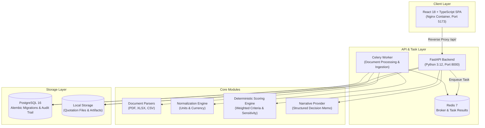

# ProcureFlow

A self-hosted, evidence-backed quotation comparison and deterministic scoring engine for procurement workflows.

> ProcureFlow is a personal open-source project created and maintained by **Marwane Benseghir**. Drawing from experience in industrial engineering and operations, I built ProcureFlow to provide a transparent, reproducible tool for evaluating supplier quotations without manual transcription errors or proprietary black-box software.

[](LICENSE)
[](RELEASE_NOTES_v0.1.0.md)
[](frontend/)
[](https://python.org)
[](https://fastapi.tiangolo.com)
[](https://react.dev)
[](https://www.postgresql.org)
[](docker-compose.yml)
[](tests/)

---

## Quickstart

Start the entire stack with a pre-seeded demonstration dataset using Docker Compose:

```bash
docker compose --profile demo up --build
```

### Services Started
- **PostgreSQL 16**: Database with schema migrations applied.
- **FastAPI Backend**: Core API on port `8000`.
- **Celery Worker**: Asynchronous document ingestion and parsing.
- **Redis**: Message broker and task state storage.
- **Nginx & React Frontend**: Web interface on port `5173`.
- **Demo Seed**: Automatically loads a sample industrial RFQ with three supplier quotes (PDF, Excel, CSV).

### Endpoints
- Web Interface: [http://localhost:5173](http://localhost:5173)
- API Documentation (Swagger): [http://localhost:8000/docs](http://localhost:8000/docs)
- Health Check: [http://localhost:8000/api/v1/health](http://localhost:8000/api/v1/health)

To stop all containers:
```bash
docker compose --profile demo down
```

---

## Why I Built This

Evaluating supplier proposals for industrial equipment usually requires comparing inconsistent documents: multi-page PDF quotes, spreadsheets with varying column layouts, and CSV exports. In most organizations, this process still relies on manual copy-pasting into a master spreadsheet.

This manual workflow creates three recurrent problems:
1. **Transcription errors**: Quantities, lead times, and unit prices are easily mistyped or transposed.
2. **Lost provenance**: Once numbers are pasted into a comparison sheet, tracing a specific value back to page 7 of a vendor PDF requires manual searching.
3. **Subjective scoring**: Vendor selection frequently happens through informal criteria or hidden spreadsheet formulas that cannot be readily audited.

Commercial procurement suites tend to be either heavy enterprise tools requiring months of integration or generic CRMs that lack document parsing and audit trails. ProcureFlow was built as a practical, transparent alternative: lightweight, self-hosted, and designed so that every number links directly back to its source file.

---

## Design Choices

- **Deterministic scoring over opaque algorithms**: Supplier rankings are calculated using explicit linear weights and configurable knockout criteria. Every score, normalization step, and formula breakdown is directly visible in the interface.
- **Document-to-value traceability**: Parsers extract text with spatial bounding boxes. Clicking an extracted price or lead time immediately highlights its exact location in the original document.
- **Buyer review and sign-off**: Automated extraction assists data entry, but the buyer retains full authority. Award decisions require explicit confirmation, and selecting a supplier other than the top-ranked vendor requires a recorded justification.
- **Self-contained deployment**: The application runs entirely within standard Docker containers without mandatory external cloud dependencies.
- **Bilingual interface**: The user interface is fully localized in English and French, including numeric formatting, currency display, and procurement terminology.

---

## Core Workflow

```
Supplier Quotations (PDF, XLSX, CSV)
       │
       ▼
[Document Ingestion & Coordinate Extraction] ──► Page and Bounding Box Highlights
       │
       ▼
[Currency & Unit Normalization]              ──► Apples-to-Apples Comparison Matrix
       │
       ▼
[Deterministic Scoring Engine]               ──► Mathematical, Verifiable Rankings
       │
       ▼
[Grounded Decision Memo]                     ──► Structured Claims Linked to Source Data
       │
       ▼
[Buyer Review & Award Authorization]         ──► Audit-Logged Sign-Off and Rationale
```

### Key Capabilities

1. **Multi-Format Ingestion**: Upload PDF, Excel, and CSV quotations. The ingestion worker parses line items, pricing, delivery dates, and payment terms.
2. **Split-Pane Review Workspace**: Inspect parsed values alongside original documents. Click any extracted number to view its bounding box in the embedded PDF or spreadsheet viewer.
3. **Comparison Matrix**: Compare line items across vendors with automatic currency conversion to the RFQ base currency and unit harmonization.
4. **Scoring & Sensitivity Sweep**: Adjust weights for cost, delivery time, warranty, and technical fit. Run sensitivity sweeps to check how score variations affect vendor rankings.
5. **Decision & Audit Log**: Review the structured decision memo, confirm the award with checklist acknowledgements, and maintain an append-only event log.

---

## System Architecture



---

## Current Limitations

To maintain clear expectations about the scope of this project:

- **Authentication**: Access is currently controlled via a single API key header (`X-API-Key`). Multi-tenant organization boundaries and single sign-on (SAML/OIDC) are not implemented.
- **Document Storage**: Uploaded files are stored on the local filesystem volume. Object storage backends (such as S3 or GCS) are not yet integrated.
- **Exchange Rates**: The demo environment uses fixed synthetic exchange rates. Connecting live financial data feeds (e.g. European Central Bank) is planned for future iterations.
- **Complex Document Layouts**: Structured tables in clean PDFs and spreadsheets extract reliably. Poorly scanned, skewed, or multi-column documents may require manual adjustments during the review step.
- **Narrative Language**: While the user interface is fully localized in English and French, generated narrative decision memos are currently output in English.

---

## Local Development (Without Docker)

### Prerequisites
- Python 3.12+
- Node.js 20+
- PostgreSQL 16 & Redis

### Backend Setup
```bash
cd backend
python -m venv .venv

# Windows:
.venv\Scripts\activate
# Linux/macOS:
source .venv/bin/activate

pip install -e ".[dev]"

# Apply database migrations
alembic upgrade head

# Start API server
uvicorn procureflow.main:app --reload --port 8000
```

### Celery Worker (Separate Terminal)
```bash
cd backend
source .venv/bin/activate
celery -A procureflow.tasks.celery_app worker --loglevel=info
```

### Frontend Setup
```bash
cd frontend
npm install
npm run dev
```

---

## Testing

```bash
# 1. Backend test suite (unit and integration tests)
cd backend
pytest -v

# 2. Database migration checks
pytest tests/integration/test_migration_safety.py
alembic check

# 3. Frontend typecheck and unit tests
cd ../frontend
npm run typecheck
npm test

# 4. End-to-end tests
npx playwright test
```

---

## Documentation & Reference

- [Architecture Decision Records (ADRs)](docs/adr/0001-architecture-and-tech-stack.md)
- [Limitations & Scope Document](docs/LIMITATIONS.md)
- [Troubleshooting Guide](docs/TROUBLESHOOTING.md)
- [Product Roadmap](docs/ROADMAP.md)
- [OpenAPI Specification](docs/api/openapi.json)
- [Contributing Guidelines](CONTRIBUTING.md)
- [Security Policy](SECURITY.md)
- [Code of Conduct](CODE_OF_CONDUCT.md)

---

## License

ProcureFlow is open-source software licensed under the [Apache License 2.0](LICENSE).
