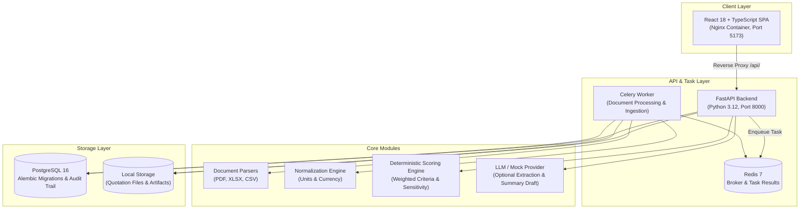

# ProcureFlow

A self-hosted, evidence-backed quotation comparison and deterministic scoring engine for procurement workflows.

> I'm **Marwane Benseghir**, with a background in logistics and innovation management. I started ProcureFlow as an exploratory project to investigate how supplier quotations can be compared more systematically and transparently, without relying on proprietary black-box software.

[](LICENSE)
[](RELEASE_NOTES_v0.1.0.md)
[](frontend/)
[](https://python.org)
[](https://fastapi.tiangolo.com)
[](https://react.dev)
[](https://www.postgresql.org)
[](docker-compose.yml)

---

## Quickstart

Start the stack with a pre-seeded demonstration dataset using Docker Compose:

```bash
docker compose --profile demo up --build
```

### Services Started
- **PostgreSQL 16**: Database with migrations applied.
- **FastAPI Backend**: REST API on port `8000`.
- **Celery Worker**: Asynchronous document ingestion and parsing.
- **Redis**: Message broker and task state storage.
- **Nginx & React Frontend**: Web interface on port `5173`.
- **Demo Seed**: Automatically loads a sample RFQ with three supplier quotes (PDF, Excel, CSV).

### Endpoints
- Web Interface: [http://localhost:5173](http://localhost:5173)
- API Documentation (Swagger): [http://localhost:8000/docs](http://localhost:8000/docs)
- Health Check: [http://localhost:8000/api/v1/health](http://localhost:8000/api/v1/health)

To stop all containers:
```bash
docker compose --profile demo down
```

---

## Why I Built This

Comparing vendor proposals is an interesting problem: quotes arrive in diverse layouts (PDF documents, spreadsheets with varied column names, or CSV files). Looking at common procurement workflows out of curiosity, much of this comparison work still seems to involve copy-pasting numbers into informal spreadsheets.

This exploratory project was built to test a more structured approach:
1. **Extraction and linking**: Investigating whether parsed line items and prices can stay directly linked to their coordinates in the source files.
2. **Standardized comparison**: Testing how unit and currency conversions can be handled consistently in a clear matrix.
3. **Transparent scoring**: Experimenting with explicit linear formulas and knockout rules rather than complex or opaque ranking systems.

Rather than attempting to replace full-scale enterprise tools, ProcureFlow is a focused sandbox exploring how self-hosted software can make quote comparison clearer and more verifiable.

---

## Design Choices

- **Deterministic scoring over opaque algorithms**: Supplier rankings are calculated using explicit linear weights and configurable knockout criteria. Scoring formulas and weight breakdowns are directly visible in the interface.
- **Document-to-value traceability**: Parsers extract text with spatial bounding boxes where available. Clicking an extracted price or lead time navigates to its location in the original document.
- **Buyer review and sign-off**: Automated extraction assists data entry, but the buyer retains authority. Award decisions require confirmation, and choosing a supplier other than the top-ranked vendor asks for a recorded justification.
- **Self-contained deployment**: The application runs within standard Docker containers without mandatory cloud dependencies.
- **Bilingual interface**: The user interface supports English and French, including numeric formatting and localized terminology.

---

## Core Workflow

```
Supplier Quotations (PDF, XLSX, CSV)
       │
       ▼
[Document Ingestion & Coordinate Extraction] ──► Page and Bounding Box Highlights
       │
       ▼
[Currency & Unit Normalization]              ──► Side-by-Side Comparison Matrix
       │
       ▼
[Deterministic Scoring Engine]               ──► Formula-Based, Verifiable Rankings
       │
       ▼
[Grounded Decision Memo]                     ──► Structured Claims Linked to Source Data
       │
       ▼
[Buyer Review & Award Authorization]         ──► Recorded Sign-Off and Rationale
```

### Key Capabilities

1. **Multi-Format Ingestion**: Upload PDF, Excel, and CSV quotations. The ingestion worker parses line items, pricing, delivery dates, and payment terms.
2. **Split-Pane Review Workspace**: Inspect parsed values alongside original documents. Click extracted values to view their bounding boxes in the embedded PDF or spreadsheet viewer.
3. **Comparison Matrix**: Compare line items across vendors with currency conversion to the RFQ base currency and unit harmonization.
4. **Scoring & Sensitivity**: Adjust weights for cost, delivery time, warranty, and technical criteria. Sensitivity sweep views show how score adjustments influence rankings.
5. **Decision & Audit Log**: Review the structured decision memo, confirm the award, and maintain an append-only event log.
6. **Narrative Assistance**: Language models can assist with structuring extracted text and proposing a draft decision memo, but scoring calculations, knockout rules, and final award authorizations remain strictly deterministic and belong to the buyer.

---

## System Architecture



---

## Current Limitations

- **Authentication**: Access is currently controlled via a single API key header (`X-API-Key`). Multi-tenant organization boundaries and single sign-on (SAML/OIDC) are not implemented.
- **Document Storage**: Uploaded files are stored on the local filesystem volume. Cloud object storage backends (such as S3 or GCS) are not yet integrated.
- **Exchange Rates**: The demo environment uses fixed synthetic exchange rates. Connecting live financial data feeds is planned for future iterations.
- **Complex Document Layouts**: Clean tabular documents extract reasonably well. Skewed scans, degraded photocopies, or irregular multi-column layouts may require manual adjustments during review.
- **Narrative Language**: While the user interface supports both English and French, generated narrative decision memos are currently produced in English.

---

## Local Development (Without Docker)

### Prerequisites
- Python 3.12+
- Node.js 20+
- PostgreSQL 16 & Redis

### Backend Setup
```bash
cd backend
python -m venv .venv

# Windows:
.venv\Scripts\activate
# Linux/macOS:
source .venv/bin/activate

pip install -e ".[dev]"

# Apply database migrations
alembic upgrade head

# Start API server
uvicorn procureflow.main:app --reload --port 8000
```

### Celery Worker (Separate Terminal)
```bash
cd backend
source .venv/bin/activate
celery -A procureflow.tasks.celery_app worker --loglevel=info
```

### Frontend Setup
```bash
cd frontend
npm install
npm run dev
```

---

## Testing

```bash
# 1. Backend test suite
cd backend
pytest -v

# 2. Database migration checks
pytest tests/integration/test_migration_safety.py
alembic check

# 3. Frontend typecheck and unit tests
cd ../frontend
npm run typecheck
npm test

# 4. End-to-end tests
npx playwright test
```

---

## Documentation & Reference

- [Architecture Decision Records (ADRs)](docs/adr/0001-architecture-and-tech-stack.md)
- [Limitations & Scope Document](docs/LIMITATIONS.md)
- [Troubleshooting Guide](docs/TROUBLESHOOTING.md)
- [Product Roadmap](docs/ROADMAP.md)
- [OpenAPI Specification](docs/api/openapi.json)
- [Contributing Guidelines](CONTRIBUTING.md)
- [Security Policy](SECURITY.md)
- [Code of Conduct](CODE_OF_CONDUCT.md)

---

## License

ProcureFlow is open-source software licensed under the [Apache License 2.0](LICENSE).
