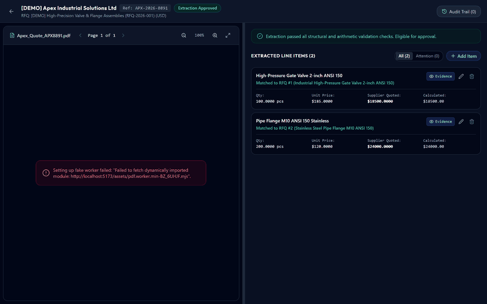
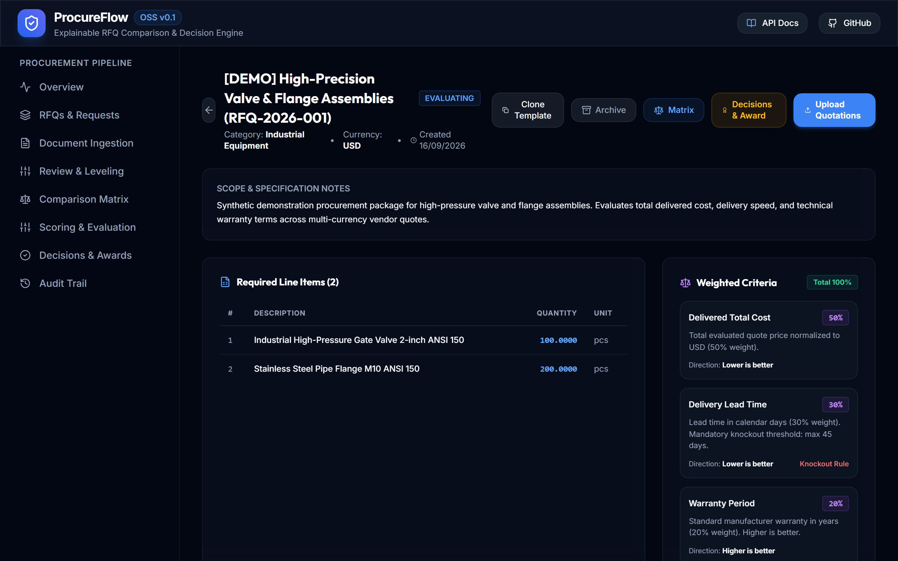
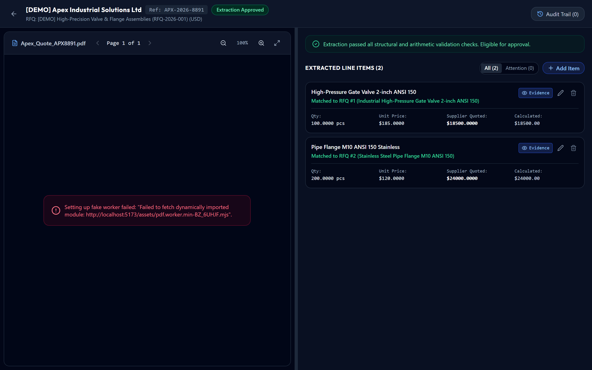
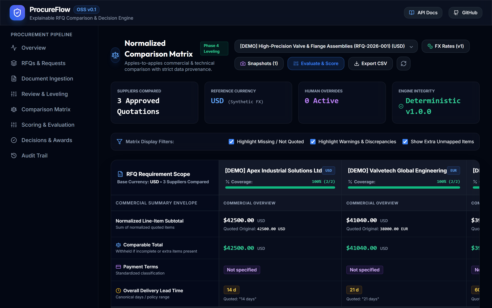
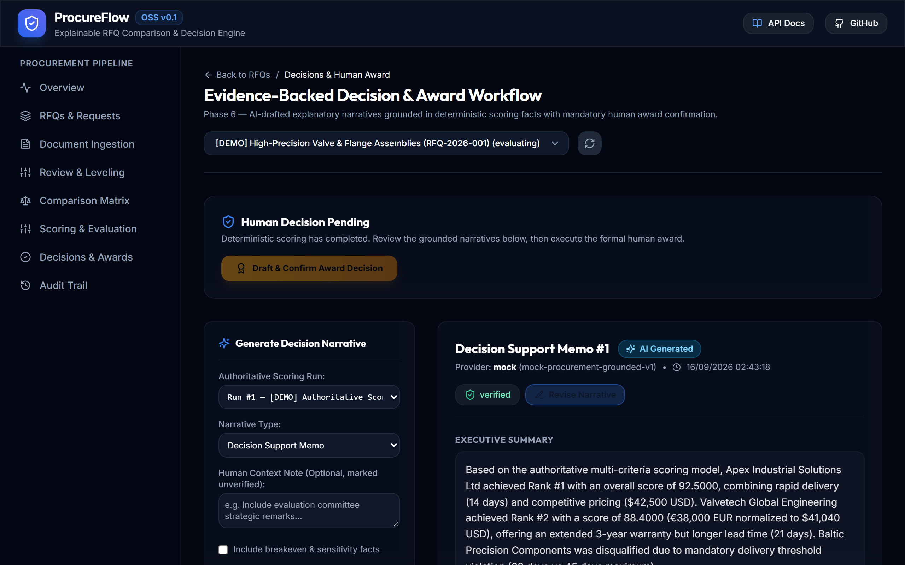
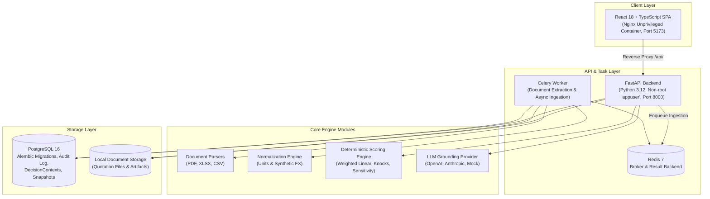

# ProcureFlow OSS

<div align="center">

<h3>Evidence-Backed RFQ Comparison & Deterministic Procurement Decision Engine</h3>

<p>
  <strong>ProcureFlow turns messy supplier quotations into evidence-backed, human-verifiable, and deterministically scored procurement decisions.</strong>
</p>

[](LICENSE)
[](RELEASE_NOTES_v0.1.0.md)
[](https://python.org)
[](https://fastapi.tiangolo.com)
[](https://react.dev)
[](https://www.postgresql.org)
[](docker-compose.yml)
[](tests/)

<br/>

<!-- Hero Demo Animation -->


</div>

---

> [!NOTE]
> **Release Positioning (v0.1.0)**: This release is an **open-source technical preview and self-hosted MVP**. It showcases deterministic quotation parsing, document source citations, multi-currency normalization, formula-based scoring, and human-in-the-loop award authorization.
> For details on production hardening performed versus deployment boundaries, see [LIMITATIONS.md](docs/LIMITATIONS.md).

---

## ⚡ True One-Command Demo

Spin up the entire stack with a pre-seeded, synthetic demonstration dataset in a single cross-platform Docker command:

```bash
docker compose --profile demo up --build
```

### What this brings up automatically:
- **PostgreSQL 16**: Database initialized with all Alembic migrations applied.
- **Demo Seed Service**: Idempotently seeds sample RFQ, supplier quotations, comparison matrix, scoring run, and grounded decision memo.
- **FastAPI Backend**: REST API with strict configuration validation on port `8000`.
- **Celery Task Worker**: Background ingestion and document processing pipeline.
- **Redis**: Asynchronous message broker and task queue.
- **Production-Hardened Frontend**: Single Page Application served via unprivileged Nginx on port `5173` with internal API reverse proxy.
- **Mock LLM Mode**: Zero external API keys or cloud accounts required out-of-the-box.

### Access Endpoints:
- **Web UI**: [http://localhost:5173](http://localhost:5173)
- **Interactive OpenAPI Docs (Swagger)**: [http://localhost:8000/docs](http://localhost:8000/docs)
- **Static OpenAPI Schema**: [docs/api/openapi.json](docs/api/openapi.json)
- **Health Check Endpoint**: [http://localhost:8000/api/v1/health](http://localhost:8000/api/v1/health)

To stop the demo:
```bash
docker compose --profile demo down
```

---

## 📊 Pre-Seeded Demonstration Dataset

The demo seed generates an end-to-end industrial procurement scenario:

- **RFQ**: `[DEMO] High-Precision Valve & Flange Assemblies (RFQ-2026-001)` (100x Gate Valves, 50x Globe Valves, 200x Flanges; Target Delivery: 30 days).
- **Supplier Quotations**:
  1. **Apex Industrial Parts Ltd** (PDF): Total $66,250 USD, 28 days lead time, 12 months warranty. Highest technical compliance, ranked **#1**.
  2. **Valvetech Global Solutions** (Excel `.xlsx`): Total €59,800 EUR, normalized to $64,584 USD, 35 days lead time, 24 months warranty. Ranked **#2**.
  3. **Baltic Valve Supply Co** (CSV): Total $54,100 USD, 60 days lead time. **Knocked out** due to mandatory criteria violation (delivery exceeds 45-day hard limit).
- **Currency Normalization**: Valvetech's EUR pricing is converted to USD using a *synthetic fixed demonstration rate* ($1.08 USD / EUR). *(Synthetic rate for demonstration purposes; live market FX feeds are roadmap items).*
- **Safety & Non-Destructive Operation**: The demo seeder is strictly idempotent. Re-running `seed-demo` will not duplicate records. The reset capability is explicitly scoped to demo-owned entities:
  ```bash
  docker compose run --rm seed-demo python -m procureflow.scripts.seed_demo --reset
  ```

---

## 🎯 The Core Problem & Differentiators

Procurement teams evaluate complex vendor quotes across incompatible formats: multi-page PDF proposals, supplier Excel price sheets, and CSV listings. Typical legacy workflows suffer from manual transcription errors, lack of document source citations, subjective spreadsheet scoring, and opaque vendor selection rationales.

```
Messy Supplier Quotes (PDF, XLSX, CSV)
       │
       ▼
[Deterministic Extraction & Source Citations] ──► Exact Page & Coordinate Highlight
       │
       ▼
[Multi-Currency & Unit Normalization]        ──► Apples-to-Apples Comparison Matrix
       │
       ▼
[Transparent Linear Scoring Engine]          ──► Mathematical, Reproducible Rankings
       │
       ▼
[Grounded LLM Decision Memo]                 ──► Quantitative Claims Backed by Data
       │
       ▼
[Human-in-the-Loop Award Confirmation]       ──► Audit-Logged Sign-Off & Rationale
```

### Why ProcureFlow is Different:
1. **Source Evidence for Every Number**: Extracted prices, quantities, and lead times link directly to their exact page, coordinate bounding box, or spreadsheet row. Clicking any value highlights its source evidence.
2. **Transparent, Deterministic Scoring**: Linear weighted criteria with explicit knockout rules. No black-box algorithms. Every score is mathematically verifiable and reproducible.
3. **Structured Claim Grounding**: Decision narratives reference deterministic structured facts (`supplier_score_ref`, `criterion_contribution_ref`, `normalized_value_ref`). Quantitative claims cannot be hallucinated.
4. **Human Authority & Audit Trail**: AI never makes purchasing decisions. An explicit human buyer sign-off is required, with mandatory written justification if deviating from the top-ranked vendor.

---

## 📸 Feature Tour

### 1. Multi-Format Ingestion & RFQ Dashboard
Upload PDF, Excel, or CSV quotations. The asynchronous ingestion worker extracts line items, pricing, delivery dates, and warranties.


### 2. Split-Pane Review & Evidence Highlighting
Inspect extracted values side-by-side with original supplier documents. Click any extracted number to instantly view its exact bounding box and line coordinates.


### 3. Multi-Supplier Comparison Matrix
Compare commercial proposals on a normalized basis. Currencies are normalized into RFQ base currency and item units are standardized.


### 4. Deterministic Scoring & Sensitivity Sweep
Configure criteria weights (Cost, Lead Time, Warranty, Technical) and knockout thresholds. Run sensitivity sweeps to evaluate ranking robustness.


### 5. Grounded Decision Narrative & Human Award Workflow
Review the AI-drafted executive summary where all quantitative claims are grounded in verified data. Award with explicit human authorization and superseded warnings.


---

## 🏛️ System Architecture



---

## 🛡️ Production Hardening vs. Preview Scope

To maintain rigorous engineering honesty, we distinguish hardening measures implemented in v0.1.0 from enterprise scope reserved for future milestones:

| Area | Implemented in v0.1.0 | Future Roadmap (Post v0.1.0) |
| :--- | :--- | :--- |
| **Container Runtime** | Non-root users (`appuser` UID 10001, `nginx` UID 101), container healthchecks, internal network reverse proxy. | Kubernetes Helm charts, container image signing. |
| **Configuration Guardrails** | Production boot crash on dev secrets, short keys (<32 chars), wildcard CORS, or mock LLM. | HashiCorp Vault / AWS Secrets Manager integration. |
| **Database Migrations** | Chained Alembic migrations with CI tests for blank-DB fresh-install and upgrade-path schema integrity. | Zero-downtime blue/green migration strategies. |
| **Audit & Governance** | Append-only event log with SHA-256 payload integrity verification. | Immutable cryptographic ledger export (RFC 6962). |
| **Tenancy & Auth** | Single-tenant, header-based API key validation (`X-API-Key`). | Multi-tenant tenant isolation, SAML 2.0 / OIDC SSO, RBAC. |
| **Document Storage** | Local filesystem abstraction with deterministic paths. | AWS S3, Google Cloud Storage, Azure Blob drivers. |
| **Financial Data** | Synthetic demonstration exchange rate (1 EUR = 1.08 USD). | Live daily FX feeds (ECB / OANDA) and commodity indices. |
| **Accessibility** | Automated WCAG 2.2 AA accessibility checks via Playwright + Axe. | Manual human accessibility audit & certification. |

*Read the full [Limitations & Scope Document](docs/LIMITATIONS.md).*

---

## 🛠️ Local Development (Without Docker)

### 1. Prerequisites
- Python 3.12+
- Node.js 20+
- PostgreSQL 16 & Redis (or run them via Docker)

### 2. Backend Setup
```bash
cd backend
python -m venv .venv
# Windows:
.venv\Scripts\activate
# Linux/macOS:
source .venv/bin/activate

pip install -e ".[dev]"

# Run database migrations
alembic upgrade head

# Optional: Seed demo data
python -m procureflow.scripts.seed_demo

# Start API server
uvicorn procureflow.main:app --reload --port 8000
```

### 3. Celery Worker (Separate Terminal)
```bash
cd backend
source .venv/bin/activate
celery -A procureflow.tasks.celery_app worker --loglevel=info
```

### 4. Frontend Setup
```bash
cd frontend
npm install
npm run dev
```

---

## 🧪 Testing & Verification Suite

ProcureFlow enforces quality through automated testing gates:

```bash
# 1. Backend test suite (Unit, Integration, Migration Safety, Grounding)
cd backend
pytest -v

# 2. Migration safety & schema drift verification
pytest tests/integration/test_migration_safety.py
alembic check

# 3. OpenAPI specification consistency check
pytest tests/unit/test_openapi_consistency.py

# 4. Frontend unit tests & TypeScript typecheck
cd ../frontend
npm run typecheck
npm run test

# 5. End-to-End & Automated WCAG 2.2 AA Accessibility Checks
npx playwright test
```

---

## 📚 Documentation & Reference

- [Architecture Decision Records (ADRs)](docs/adr/0001-architecture-and-tech-stack.md)
- [Limitations & Scope](docs/LIMITATIONS.md)
- [Troubleshooting Guide](docs/TROUBLESHOOTING.md)
- [Product Roadmap](docs/ROADMAP.md)
- [OpenAPI Specification](docs/api/openapi.json)
- [Release Notes](RELEASE_NOTES_v0.1.0.md)
- [Contributing Guidelines](CONTRIBUTING.md)
- [Security Policy](SECURITY.md)
- [Code of Conduct](CODE_OF_CONDUCT.md)

---

## 📄 License

ProcureFlow OSS is open-source software licensed under the [Apache License 2.0](LICENSE).
