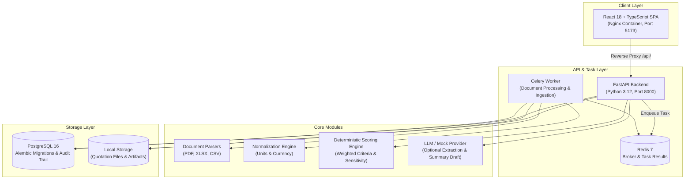

# ProcureFlow

A self-hosted, evidence-backed quotation comparison and deterministic scoring engine for procurement workflows.

[](https://github.com/mbs20/procureflow/actions/workflows/ci.yml)
[](LICENSE)
[](backend/pyproject.toml)
[](frontend/package.json)
[](docker-compose.yml)

ProcureFlow is under active development. Bug reports, feature proposals, documentation contributions, and pull requests are welcome. Start with the [contributing guide](CONTRIBUTING.md) or [open an issue](https://github.com/mbs20/procureflow/issues/new/choose). Report security vulnerabilities privately using the [security policy](SECURITY.md).

> ProcureFlow was started as an open-source exploration of how supplier quotations can be compared more systematically, transparently, and reproducibly without relying on proprietary black-box procurement software.

## Project Status

| Scope | Status |
|---|---|
| Implemented | RFQs, PDF/CSV/XLSX ingestion, human review, comparison snapshots, deterministic scoring and sensitivity, draft narratives, explicit award confirmation, application event history. |
| Demonstration | The Compose demo uses synthetic supplier documents, fixed example exchange rates, a shared development API key, and an offline mock provider. It is for local evaluation, not a hardened public deployment. |
| Roadmap | Individual identity and roles, tenant isolation, object storage, live FX feeds, and ERP integrations are not implemented. See the [roadmap](docs/ROADMAP.md); proposed milestones are not delivery commitments. |

The CI badge reports the `main` workflow status. The other badges identify the license and technologies, not adoption or certification.

---

## Quickstart

Prerequisites: Git, Docker with Compose v2, and a running Docker engine. From a terminal:

```bash
git clone https://github.com/mbs20/procureflow.git
cd procureflow
```

Start the development/demo stack with a pre-seeded synthetic dataset using Docker Compose. Use a trusted machine; the supplied configuration is not suitable for public exposure:

```bash
docker compose --profile demo up --build
```

### Services Started

- **PostgreSQL 16**: Database with migrations applied.
- **FastAPI Backend**: REST API on port `8000`.
- **Celery Worker**: Asynchronous document ingestion and parsing.
- **Redis**: Message broker and task state storage.
- **Nginx & React Frontend**: Web interface on port `5173`.
- **Demo Seed**: Automatically loads a sample RFQ with three supplier quotes (PDF, Excel, CSV).

### Endpoints

- Web Interface: [http://localhost:5173](http://localhost:5173)
- API Documentation (Swagger): [http://localhost:8000/docs](http://localhost:8000/docs)
- Health Check: [http://localhost:8000/api/v1/health](http://localhost:8000/api/v1/health)

To stop all containers:
```bash
docker compose --profile demo down
```

---

## Why I Built This

Comparing vendor proposals is an interesting problem: quotes arrive in diverse layouts (PDF documents, spreadsheets with varied column names, or CSV files). Looking at common procurement workflows out of curiosity, much of this comparison work still seems to involve copy-pasting numbers into informal spreadsheets.

This exploratory project was built to test a more structured approach:

1. **Extraction and linking**: Investigating whether parsed line items and prices can stay directly linked to their coordinates in the source files.
2. **Standardized comparison**: Testing how unit and currency conversions can be handled consistently in a clear matrix.
3. **Transparent scoring**: Experimenting with explicit linear formulas and knockout rules rather than complex or opaque ranking systems.

Rather than attempting to replace full-scale enterprise tools, ProcureFlow is a focused sandbox exploring how self-hosted software can make quote comparison clearer and more verifiable.

---

## Design Choices

- **Deterministic scoring over opaque algorithms**: Supplier rankings are calculated using explicit linear weights and configurable knockout criteria. Scoring formulas and weight breakdowns are directly visible in the interface.
- **Document-to-value traceability**: Parsers extract text with spatial bounding boxes where available. Where source evidence is available, clicking an extracted value navigates to its source. Table citations may lack bounding boxes and OCR citations may cover a whole page.
- **Buyer review and sign-off**: Automated extraction assists data entry, but the buyer retains authority. Award decisions require confirmation, and choosing a supplier other than the top-ranked vendor asks for a recorded justification.
- **Self-contained deployment**: The application runs within standard Docker containers without mandatory cloud dependencies.
- **Bilingual interface**: The user interface supports English and French, including numeric formatting and localized terminology.

---

## Core Workflow

```
Supplier Quotations (PDF, XLSX, CSV)
       │
       ▼
[Document Ingestion & Extraction]            ──► Available Source Citations
       │
       ▼
[Human Review & Correction]                  ──► Approved Values for Comparison
       │
       ▼
[Currency & Unit Normalization]              ──► Side-by-Side Comparison Matrix
       │
       ▼
[Deterministic Scoring Engine]               ──► Formula-Based, Verifiable Rankings
       │
       ▼
[Grounded Decision Memo]                     ──► Structured Claims Linked to Source Data
       │
       ▼
[Buyer Review & Award Authorization]         ──► Recorded Sign-Off and Rationale
```

### Key Capabilities

1. **Multi-Format Ingestion**: Upload PDF, XLSX, and CSV quotations. Extracted line items and commercial fields depend on the document layout and require review; legacy XLS is unsupported.
2. **Split-Pane Review Workspace**: Inspect parsed values alongside original documents and navigate available source citations. Not all fields have precise bounding boxes.
3. **Comparison Matrix**: Compare line items across vendors with currency conversion to the RFQ base currency and unit harmonization.
4. **Scoring & Sensitivity**: Adjust weights for cost, delivery time, warranty, and technical criteria. Sensitivity sweep views show how score adjustments influence rankings.
5. **Decision & Audit Log**: Review the structured decision memo, confirm the award, and maintain an append-only event log.
6. **Narrative Assistance**: Configurable providers can structure extracted text and propose draft memos. Scoring and knockout rules use deterministic calculations; award confirmation remains a separate explicit action. See [provider boundaries](docs/adr/0002-llm-abstraction-and-instructor.md).

---

## System Architecture


```mermaid
graph TD
    subgraph Client Layer
        UI["React 18 + TypeScript SPA<br/>(Nginx Container, Port 5173)"]
    end

    subgraph API & Task Layer
        API["FastAPI Backend<br/>(Python 3.12, Port 8000)"]
        Worker["Celery Worker<br/>(Document Processing & Ingestion)"]
        Redis[("Redis 7<br/>Broker & Task Results")]
    end

    subgraph Core Modules
        Parsers["Document Parsers<br/>(PDF, XLSX, CSV)"]
        Norm["Normalization Engine<br/>(Units & Currency)"]
        Scorer["Deterministic Scoring Engine<br/>(Weighted Criteria & Sensitivity)"]
        LLM["LLM / Mock Provider<br/>(Optional Extraction & Summary Draft)"]
    end

    subgraph Storage Layer
        DB[("PostgreSQL 16<br/>Alembic Migrations & Audit Trail")]
        Filesystem[("Local Storage<br/>(Quotation Files & Artifacts)")]
    end

    UI -->|Reverse Proxy /api/| API
    API --> DB
    API --> Filesystem
    API -->|Enqueue Task| Redis
    Worker --> Redis
    Worker --> Parsers
    Worker --> Norm
    Worker --> DB
    Worker --> Filesystem
    API --> Scorer
    API --> LLM
```

---

## Current Limitations

- **Authentication**: Protected operations use a shared API-key principal (`X-API-Key`), not verified individual identities or human signatures. The demo browser embeds a development key and document preview routes lack individual access checks. Restrict the whole deployment behind an authenticated perimeter; see [deployment boundaries](docs/LIMITATIONS.md).
- **Document Storage**: Uploaded files are stored on the local filesystem volume. Cloud object storage backends (such as S3 or GCS) are not yet integrated.
- **Exchange Rates**: The demo environment uses fixed synthetic exchange rates. Connecting live financial data feeds is planned for future iterations.
- **Complex Document Layouts**: Clean tabular documents extract reasonably well. Skewed scans, degraded photocopies, or irregular multi-column layouts may require manual adjustments during review.
- **Narrative Language**: While the user interface supports both English and French, generated narrative decision memos are currently produced in English.

---

## Local Development (Without Docker)

### Prerequisites

- Python 3.12 (the CI version) and [uv](https://docs.astral.sh/uv/getting-started/installation/).
- Node.js 20 and npm (matching CI).
- Tesseract on your PATH if you want OCR for scanned PDFs; native PDF/CSV/XLSX fixtures do not require it.

The lightweight setup below uses SQLite, synchronous extraction, and the offline mock provider. No PostgreSQL, Redis, worker, or paid provider key is needed. Use Docker for the distributed PostgreSQL/Redis workflow.

### Backend Setup
```bash
cd backend
uv sync --frozen --extra dev
```

Activate the environment using the command for your shell:

```bat
:: Windows Command Prompt
.venv\Scripts\activate
```

```powershell
# Windows PowerShell
.\.venv\Scripts\Activate.ps1
```

```bash
# Linux/macOS
source .venv/bin/activate
```

Activation is optional: prefix backend commands with `uv run --no-sync` to use the installed environment directly, including when PowerShell script activation is unavailable.

Create `backend/.env` with the following local-only settings. Settings are read from the current working directory, so start backend commands from `backend/`:

```dotenv
PROCUREFLOW_ENV=development
PROCUREFLOW_LLM_PROVIDER=mock
DATABASE_URL=sqlite+aiosqlite:///./procureflow.db
DATABASE_URL_SYNC=sqlite:///./procureflow.db
CELERY_ALWAYS_EAGER=true
CELERY_BROKER_URL=memory://
CELERY_RESULT_BACKEND=cache+memory://
STORAGE_LOCAL_DIR=./data/storage
```

Then run:

```bash
alembic upgrade head
uvicorn procureflow.main:app --reload --port 8000
```

Eager mode runs extraction within the request and can block the API during parsing. For a separate worker, use the Docker quickstart or configure PostgreSQL/Redis URLs, set `CELERY_ALWAYS_EAGER=false`, and start `celery -A procureflow.tasks.celery_app worker --loglevel=info` from an activated backend terminal. Use Docker or WSL for workers on Windows.

The root `.env.example` documents additional settings; its PostgreSQL settings are an alternative to the SQLite setup, not prerequisites for it. A root `.env` is used by Compose for interpolation and is not automatically loaded by Python started inside `backend/`.

### Frontend Setup

In a second terminal, from the repository root:

```bash
cd frontend
npm ci
npm run dev
```

Open [http://localhost:5173](http://localhost:5173). Vite proxies `/api` to the backend on port 8000. The browser uses the shared development API key. Do not run the Docker frontend and Vite on the same port at the same time.

---

## Testing

After installing dependencies, run from the repository root (no activation needed with `uv run`):

```bash
cd backend
uv run --no-sync ruff check src tests
uv run --no-sync ruff format --check src tests
uv run --no-sync mypy src/
uv run --no-sync pytest

cd ../frontend
npm run typecheck
npm test
npm run build
```

Backend tests use temporary SQLite databases and mock transports. CI runs schema-drift validation through `command.check(alembic_cfg)` inside `test_fresh_migration_and_schema_drift()`, which is part of the pytest suite. The standalone `alembic check` CLI command can also be run manually; CI does not invoke that command directly.

For browser tests, install Chromium once, start the Docker stack for live integration coverage, and run from `frontend/`:

```bash
npx playwright install chromium
npx playwright test
```

On Linux, use `npx playwright install --with-deps chromium` to install browser system dependencies. Without Docker, the live tests are skipped; see [validation and contribution instructions](CONTRIBUTING.md) for the explicit Docker command and test subset.

---

## Documentation & Reference

- [Architecture Decision Records (ADRs)](docs/adr/0001-architecture-and-tech-stack.md)
- [Limitations & Scope Document](docs/LIMITATIONS.md)
- [Provider Configuration](docs/adr/0002-llm-abstraction-and-instructor.md)
- [Reproducible Extraction Evaluation](docs/EXTRACTION_EVALUATION.md)
- [Troubleshooting Guide](docs/TROUBLESHOOTING.md)
- [Product Roadmap](docs/ROADMAP.md)
- [OpenAPI Specification](docs/api/openapi.json)
- [Contributing Guidelines](CONTRIBUTING.md)
- [Security Policy](SECURITY.md)
- [Code of Conduct](CODE_OF_CONDUCT.md)

---

## License

ProcureFlow is open-source software licensed under the [Apache License 2.0](LICENSE).
